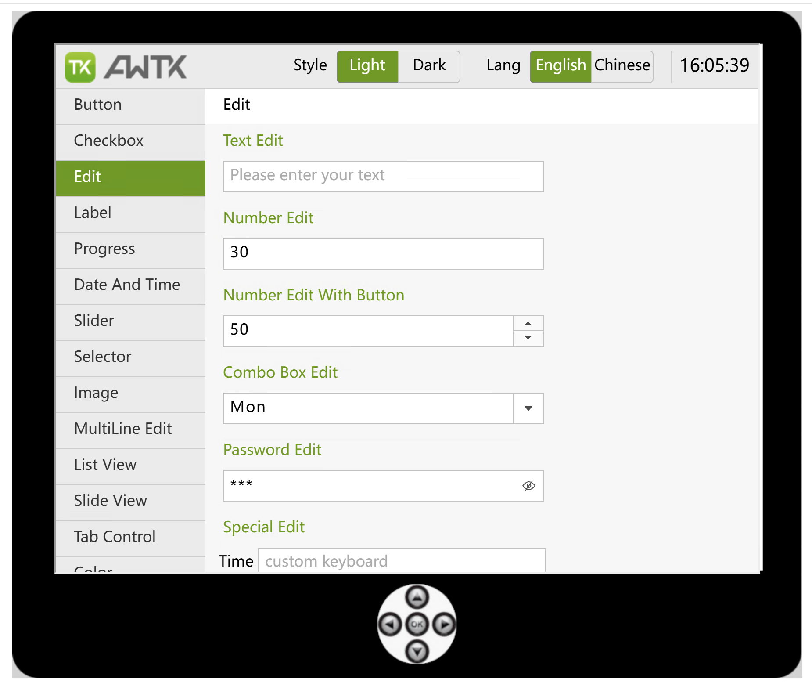

# AWTK-WEB



老用户请花点时间看看 [新版改动](docs/new_build.md)

## 一、介绍

[AWTK-WEB](https://github.com/zlgopen/awtk-web) 让 [AWTK](https://github.com/zlgopen/awtk) 能够在浏览器中运行，这除了看起来比较酷，也有具有实际的意义：

* 让用 C 语言开发的 [AWTK](https://github.com/zlgopen/awtk) 应用程序，在不需要修改源码的情况下，能在浏览器中运行。可以方便的向客户展示项目，只需分享一个链接，客户就可以在浏览器中看到实际的运行效果。

* 把 AWTK 编译成一个 JS 库，你可以用 JS 开发 AWTK 应用程序，并在浏览器中运行。

在线演示：[demoui](https://awtk.zlg.cn/demos/awtk/demoui/index.html)

## 二、目标

[AWTK-WEB](https://github.com/zlgopen/awtk-web) 不是简单的把 [AWTK](https://github.com/zlgopen/awtk) 编译成 JS，让它在浏览器中运行，那样是无法满足一些非功能性的需求的。我们把 [AWTK-WEB](https://github.com/zlgopen/awtk-web) 当作一个全新平台去移植，并充分考虑 WEB 平台的特点，有针对性的去实现以下的目标。

* 小。在 web 上运行的应用程序，体积小是非常重要的，体积越小打开越快，这直接影响用户体验。

> 为了减小代码的体积， [AWTK](https://github.com/zlgopen/awtk) 去掉了 SDL 和 stb 等库的依赖，尽量使用浏览器本身的功能，这极大程度减小了代码的体积。
>
> 为了减小资源的体积， [AWTK](https://github.com/zlgopen/awtk) 的缺省字体使用了浏览器的字体，输入法使用浏览器的输入法。

我们可以对比一下各个 GUI 的 wasm 文件的大小。

| GUI  | wasm 大小 | 网址                                                                    |
| ---- | --------: | :---------------------------------------------------------------------- |
| QT   |        9M | http://example.qt.io/qt-webassembly/SensorTagDemo/SensorTagDemo.html    |
| QT   |        3M | http://example.qt.io/qt-webassembly/opengl/hellowindow/hellowindow.html |
| AWTK |      0.7M | 与应用程序资源有关                                                      |

* 快。Android 手机浏览器性能普遍不高，要到达实用价值，性能优化至关重要。

> [AWTK-WEB](https://github.com/zlgopen/awtk-web) 的窗口动画采用了 WebGL 直接贴图进行优化，在支持 WebGL 的浏览器中，窗口动画性能接近原生效果。

* 省电。在手机等电池供电的系统上，省电是必须要考虑的。

> [AWTK-WEB](https://github.com/zlgopen/awtk-web) 启用脏矩形算法，界面不变就不绘制，有变化只绘制变化的区域，这极大的降低了电能的消耗。

* 跨平台。除了在 PC 的各种浏览器（除老的 IE 浏览器）上运行，还需要在 Android 和 iOS 上运行。[AWTK-WEB](https://github.com/zlgopen/awtk-web) 的基本要求只是浏览器支持 HTML5 的 canvas，在 Chorome、Firefox 和 IE 等主流浏览器，以及目前流行的 Android 和 iOS 设备上都能正常运行。


## 三、编译

1. 先安装必要的软件包

* [scons](https://scons.org/)
* [python](https://www.python.org/)
* [cmake](https://cmake.org/)
* [git](https://git-scm.com/)
* [emscripten](https://emscripten.org/docs/getting_started/downloads.html)

> Windows 下，如果没有 gnu make，可以用 choco 安装 ninja（在管理员权限下运行命令提示符 cmd，然后执行下面的命令）

```
choco install ninja
```

1. 编译 awtk 本身

```
git clone https://github.com/zlgopen/awtk.git
cd awtk
scons -j 8
```

3. 下载 awtk-web

```
git clone https://github.com/zlgopen/awtk-web.git
cd awtk-web
```

4. 编译 demoui

* MacOS

> 请先修改 build_mac.sh 中 emsdk_env.sh 和 python 的路径，然后运行：

```
./build_mac.sh ../awtk/build.json release
```

* Linux

> 请先修改 build_linux.sh 中 emsdk_env.sh 和 python 的路径，然后运行：

```
./build_linux.sh ../awtk/build.json release
```

* Windows（请在 git 的 bash 终端下运行）

> 请先修改 build_win32.sh 中 emsdk_env.sh 和 python 的路径，然后运行：

```
./build_win32.sh ../awtk/build.json release
```

> 编译脚本有更多选项，比如可以根据需要只更新资源或代码。

```shell
Usage: ./build_mac.sh app.json action(all|debug|release|assets|awtk_web_js|awtk_js|js)
=============================================================
  debug:        build debug version.
  release:      build release version.
  assets:       build assets only.
  awtk_js:      build awtk_js only.
  awtk_web_js:  build awtk_web_js only.
  js:           build awtk_js and awtk_web_js only.
  all:          same as debug. build debug version.
=============================================================
```

## 四、运行

1. 启动 web 服务器

* release 版本
  
```
python -m http.server 8080 --directory webroot
```

或者

```sh
./start_web.sh
```

* debug 版本

```
python -m http.server 8080 --directory build
```

或者

```sh
./start_web_debug.sh
```

> 使用其它 web 服务器均可。

1. 用浏览器打开 [http://localhost:8080/demoui/index.html](http://localhost:8080/demoui/index.html)

## 五、已知问题

* GIF 文件仅在 saferi 和 iOS 上工作。
* 只能调用 awtk、标准 C 库，和其它有源代码的库。
* 不支持模态对话框。dialog\_modal 不会生效，而 dialog\_quit 会直接关闭对话框。

## 六、注意事项

## 七、实现笔记

1.[移植笔记-序](docs/porting_notes_0.md)

2.[移植笔记-基础知识](docs/porting_notes_1.md)

3.[移植笔记-字体](docs/porting_notes_2.md)

4.[移植笔记-图片](docs/porting_notes_3.md)

5.[移植笔记-输入法](docs/porting_notes_4.md)

6.[移植笔记-画布](docs/porting_notes_5.md)

## 八、开发文档

* [C/C++ 应用程序快速入门](docs/get_started_c_app.md)

* [JS 应用程序快速入门](docs/get_started_js_app.md)

* [emscripten api 参考](https://emscripten.org/docs/api_reference/index.html)

* [调试方法](https://www.cnblogs.com/bigben0123/articles/15753240.html)

## 九、示例

* [JS 示例 1 ](https://github.com/zlgopen/awtk-web/blob/master/examples/button/build.json)

* [JS 示例 2 ](https://github.com/zlgopen/awtk-web/blob/master/examples/button_xml/build.json)

* [JS 示例 3 ](https://github.com/zlgopen/awtk-web/blob/master/examples/AwtkApplicationJS/build.json)

* [C/C++ 示例 1 ](https://github.com/zlgopen/awtk/blob/master/build.json)

* [C/C++ 示例 2 ](https://github.com/zlgopen/awtk-web/blob/master/examples/AwtkApplicationC/build.json)
