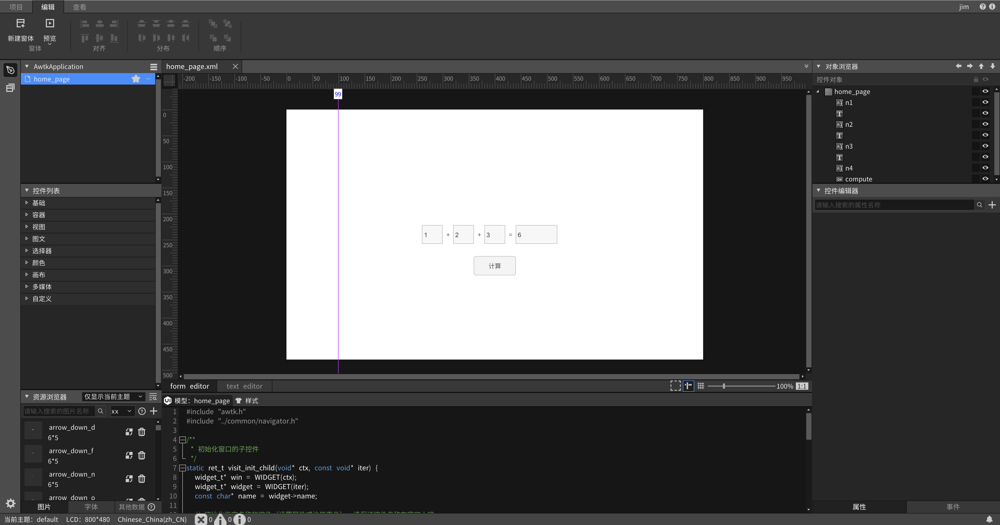
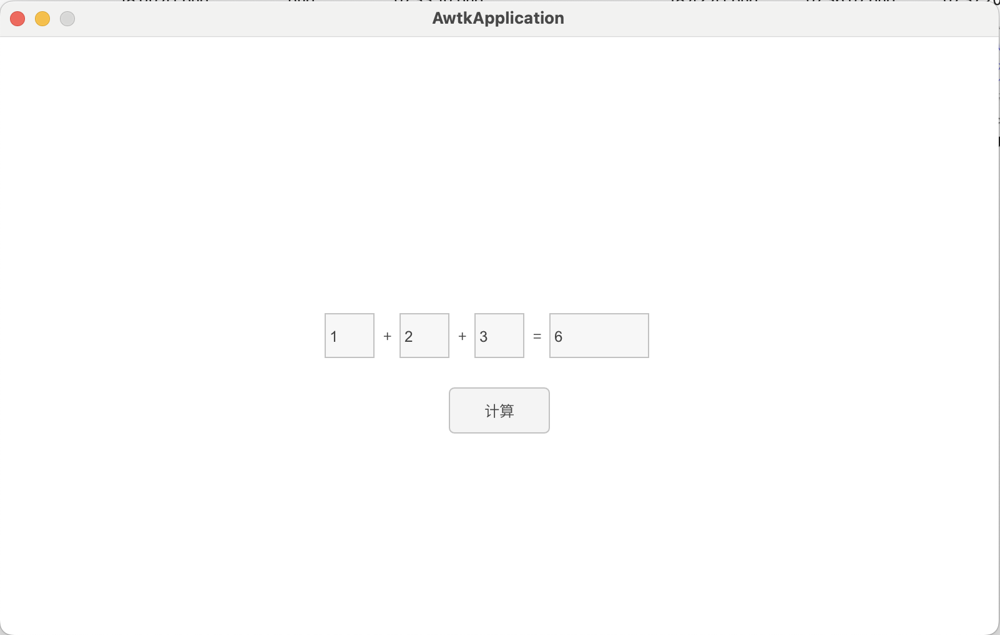
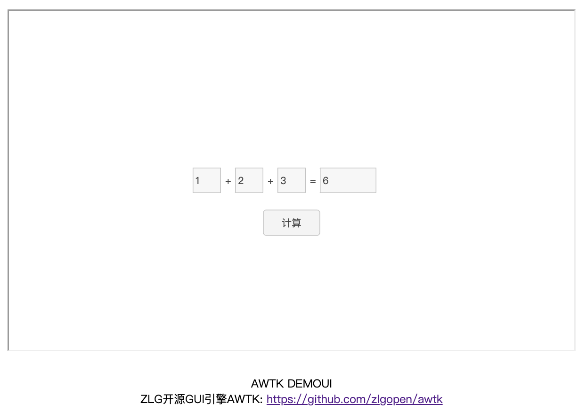

# AWTK-WEB 快速入门 - 以源码方式使用第三方库

> 先安装 [AWTK Designer](https://awtk.zlg.cn/web/index.html)

假设我们需要使用第三方库中的一个函数。

* 其函数原型如下

```
int sum(int a, int b, int c);
```

* 头文件为 foo.h

* 源文件为 foo.c

* 把代码放在 3rd/foo 目录下

## 用 AWTK Designer 新建一个应用程序

### 2.1. 新建应用程序

> 这里假设应用程序的名称为 AwtkApplicationC3rdSource，后面会用到，如果使用其它名称，后面要做相应修改。



### 2.2. 编写代码

* 用 [VSCode](https://code.visualstudio.com/) 打开目录 AwtkApplicationC3rdSource，并打开文件 src/pages/home_page.c 

> 使用其它文本编辑器或 IDE 也可以，推荐使用 [VSCode](https://code.visualstudio.com/)，并开启 Copilot，将大幅提升开发效率。

* 添加事件处理函数。可以参考下面的代码

```c
static ret_t on_compute(void* ctx, event_t* evt) {
  widget_t* win = WIDGET(ctx);
  widget_t* edit_n1 = widget_lookup(win, "n1", TRUE);
  int n1 = widget_get_value_int(edit_n1);
  
  widget_t* edit_n2 = widget_lookup(win, "n2", TRUE);
  int n2 = widget_get_value_int(edit_n2);
  
  widget_t* edit_n3 = widget_lookup(win, "n3", TRUE);
  int n3 = widget_get_value_int(edit_n3);

  widget_t* edit_n4 = widget_lookup(win, "n4", TRUE);

  widget_set_value_int(edit_n4, sum(n1, n2, n3));

  return RET_OK; 
}

/**
 * 初始化窗口的子控件
 */
static ret_t visit_init_child(void* ctx, const void* iter) {
  widget_t* win = WIDGET(ctx);
  widget_t* widget = WIDGET(iter);
  const char* name = widget->name;

  // 初始化指定名称的控件（设置属性或注册事件），请保证控件名称在窗口上唯一
  if (name != NULL && *name != '\0') {
    if (tk_str_ieq(name, "compute")) {
      widget_on(widget, EVT_CLICK, on_compute, win);
    }
  }

  return RET_OK;
}

/**
 * 初始化窗口
 */
ret_t home_page_init(widget_t* win, void* ctx) {
  (void)ctx;
  return_value_if_fail(win != NULL, RET_BAD_PARAMS);

  widget_foreach(win, visit_init_child, win);

  return RET_OK;
}
```

> 注意：控件的名称一定要和 home_page.xml 保持一致。

### 2.3. 在 AWTK Designer 中，执行“打包” “编译” “模拟运行”


正常情况下可以看到如下界面：



## 3. 编写配置文件

* 具体格式请参考 [特殊平台编译配置](https://github.com/zlgopen/awtk/blob/master/docs/build_config.md)

这里给出一个例子，可以在此基础上进行修改（该文件位于 examples/AwtkApplicationC3rdSource/build.json )：

```json
{
  "name": "AwtkApplicationC3rdSource",
  "version": "1.0",
  "assets": "res/assets",
  "vendor": "zlgopen",
  "app_name": "org.zlgopen.AwtkApplicationC3rdSource",
  "author": "xianjimli@hotmail.com",
  "copyright": "Guangzhou ZHIYUAN Electronics Co.,Ltd.",
  "themes":["default"],
  "sources": [
     "3rd/foo/*.c",
     "3rd/foo/*.h",
     "src/*.c",
     "src/common/*.c",
     "src/pages/*.c",
     "src/*.h",
     "src/common/*.h",
     "src/pages/*.h"
  ],
  "web": {
    "app_type": "c",
    "assets": "design",
    "includes":[],
    "cflags":"-DUSE_FOO",
    "cxxflags":"-DUSE_FOO",
    "config": {
      "fontScale": "0.8",
      "defaultFont": "sans"
    }
  }
}
```

> 第三方源文件统一放的 3rd 目录下。

使用第三方库时，通常需要定义一些宏，设置更多头文件搜索路径。可以用下面的参数：

* includes 设置头文件搜索路径，可以是绝对路径，或应用程序目录下的相对路径。

* cflags C 语言文件编译需要的标志（如-DUSE_FOO 定义了宏 USE_FOO)。

* cxxflags C++ 语言文件编译需要的标志（如-DUSE_FOO 定义了宏 USE_FOO)。

## 4. 编译 WEB 应用程序

进入 awtk-web 目录，不同平台使用不同的脚本编译：

* Windows 平台

```sh
./build_win32.sh examples/AwtkApplicationC3rdSource/build.json release
```

* Linux 平台

```sh
./build_linux.sh examples/AwtkApplicationC3rdSource/build.json release
```

* MacOS 平台

```sh
./build_mac.sh examples/AwtkApplicationC3rdSource/build.json release
```

> 请根据应用程序所在目录，修改配置文件的路径。

## 5 运行

* 正常启动

```sh
./start_web.sh
```

* 调试启动

```sh
start_web_debug.sh
```

* 用浏览器打开 URL：http://localhost:8080/AwtkApplicationC3rdSource


