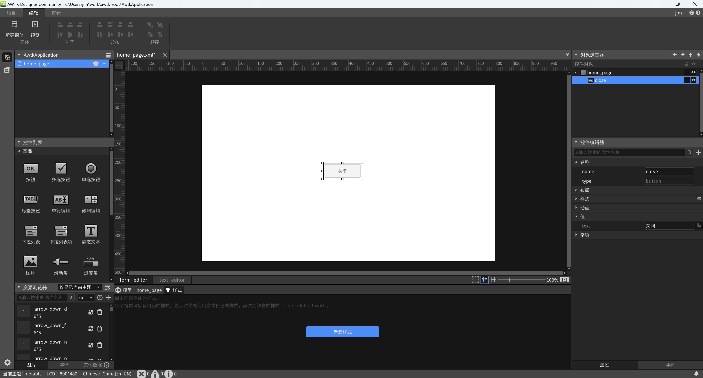
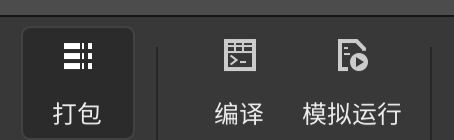
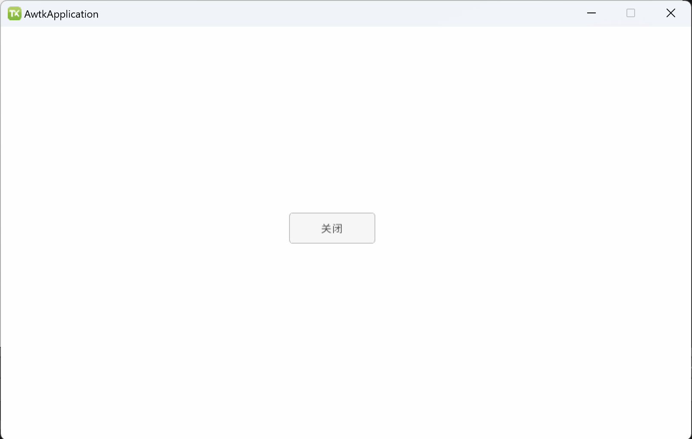
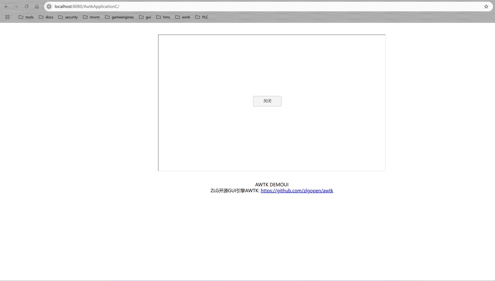
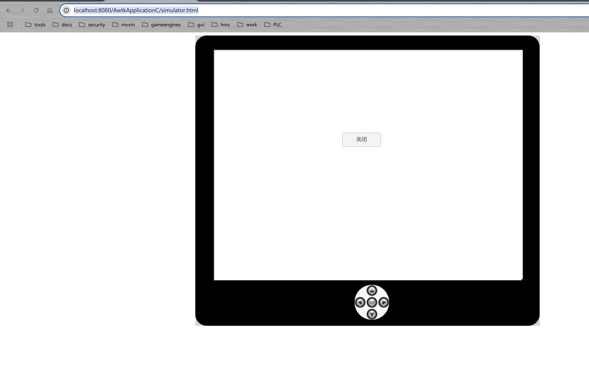
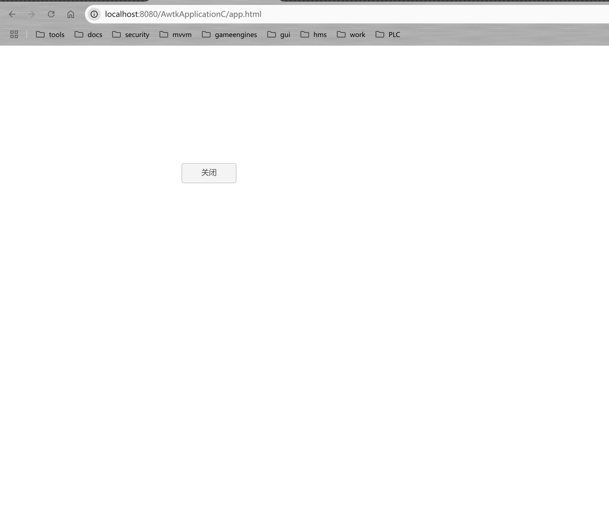

# AWTK-WEB 快速入门 - C 语言应用程序

> 先安装 [AWTK Designer](https://awtk.zlg.cn/web/index.html)

## 用 AWTK Designer 新建一个应用程序

### 2.1. 新建应用程序

> 这里假设应用程序的名称为 AwtkApplicationC，后面会用到，如果使用其它名称，后面要做相应修改。

* 在窗口上放置一个按钮
* 将按钮的名称改为 "close"
* 将按钮的文本改为 "关闭"



### 2.2. 为按钮编写代码

* 用 [VSCode](https://code.visualstudio.com/) 打开目录 AwtkApplicationC，并打开文件 src/pages/home_page.c 

> 使用其它文本编辑器或 IDE 也可以，推荐使用 [VSCode](https://code.visualstudio.com/)，并开启 Copilot，将大幅提升开发效率。

* 添加 close 按钮的事件处理函数。可以参考下面的代码

```c
static ret_t on_close(void* ctx, event_t* evt) {
  return tk_quit();
}

/**
 * 初始化窗口的子控件
 */
static ret_t visit_init_child(void* ctx, const void* iter) {
  widget_t* win = WIDGET(ctx);
  widget_t* widget = WIDGET(iter);
  const char* name = widget->name;

  // 初始化指定名称的控件（设置属性或注册事件），请保证控件名称在窗口上唯一
  if (name != NULL && *name != '\0') {
    if (tk_str_ieq(name, "close")) {
      widget_on(widget, EVT_CLICK, on_close, win);
    }
  }

  return RET_OK;
}
```

### 2.3. 在 AWTK Designer 中，执行“打包” “编译” “模拟运行”



正常情况下可以看到如下界面：



点击“关闭”按钮，退出应用程序。

## 3. 编写配置文件

* 具体格式请参考 [特殊平台编译配置](https://github.com/zlgopen/awtk/blob/master/docs/build_config.md)

这里给出一个例子，可以在此基础上进行修改（该文件位于 examples/AwtkApplicationC/build.json )：

```json
{
  "name": "AwtkApplicationC",
  "version": "1.0",
  "assets": "res/assets",
  "vendor": "zlgopen",
  "app_name": "org.zlgopen.AwtkApplicationC",
  "author": "xianjimli@hotmail.com",
  "copyright": "Guangzhou ZHIYUAN Electronics Co.,Ltd.",
  "themes":["default"],
  "sources": [
     "src/*.c",
     "src/common/*.c",
     "src/pages/*.c",
     "src/*.h",
     "src/common/*.h",
     "src/pages/*.c",
     "res/assets.inc",
     "res/assets/__assets_default.inc"
  ],
  "web": {
    "app_type": "c",
    "assets": "design",
    "config": {
      "fontScale": "0.8",
      "defaultFont": "sans"
    }
  },
  "harmonyos": {
    "icon": "design/default/images/xx/app_icon.png",
    "title": {
      "en_US": "MyApp",
      "zh_CN": "AwtkApp"
    },
    "config": {
      "defaultFont": "default_full"
    },
    "sources": [
    ]
  },
  "android": {
    "sources": [
    ]
  },
  "ios": {
    "sources": [
    ]
  }
}
```

如果不需要 android/harmonyos/ios 等平台，可以自行删除相应的配置。

## 4. 编译 WEB 应用程序

进入 awtk-web 目录，不同平台使用不同的脚本编译：

* Windows 平台

```sh
./build_win32.sh examples/AwtkApplicationC/build.json release
```

* Linux 平台

```sh
./build_linux.sh examples/AwtkApplicationC/build.json release
```

* MacOS 平台

```sh
./build_macos.sh examples/AwtkApplicationC/build.json release
```

> 请根据应用程序所在目录，修改配置文件的路径。

## 5 运行

* 正常启动

```sh
./start_web.sh
```

* 调试启动

```sh
start_web_debug.sh
```

* 用浏览器打开 URL：http://localhost:8080/AwtkApplicationC

可以看到



* 用浏览器打开 http://localhost:8080/AwtkApplicationC/simulator.html

可以看到



* 用浏览器打开 http://localhost:8080/AwtkApplicationC/app.html

可以看到




## 6、AWTK-WEB-JS 和 AWTK-JS 不同

两者在 API 上基本上是一样的，但是由于浏览器和 Jerryscript 的差异，导致少量功能无法做到完全一致，需要应用程序自行规避。

* 1.AWTK-WEB-JS 不支持模态对话框。
* 2.AWTK-WEB-JS 中的 print 函数是打印。请使用 console.log 输出调试信息。
* 3.AWTK-WEB-JS 不支持自动回收在 wasm 中分配的对象（如：color/rect/value 等）。如果希望两者通用，请避免使用这类函数。
* 4.tk_quit 函数并不能退出应用程序。
