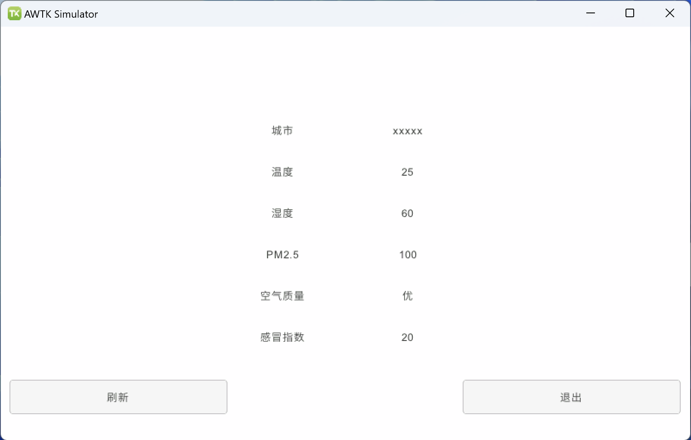

# AWTK-WEB 快速入门 - C 语言 Http 应用程序

> AWTK 可以使用相同的技术栈开发各种平台的应用程序。有时我们需要使用 Web 界面显示设备的信息、控制设备的行为和与设备进行交互，这时就该 AWTK-WEB 上场了。本文介绍一下如何使用 C 语言开发 AWTK-WEB 应用程序，并用 HTTP 访问远程数据。

## 用 AWTK Designer 新建一个应用程序

> 先安装 [AWTK Designer](https://awtk.zlg.cn/web/index.html)

### 2.1. 新建应用程序

> 这里假设应用程序的名称为 AwtkApplicationCHttp，后面会用到，如果使用其它名称，后面要做相应修改。


### 2.2. 编写代码

* 用 [VSCode](https://code.visualstudio.com/) 打开目录 AwtkApplicationCHttp，并打开文件 src/pages/home_page.c 

> 使用其它文本编辑器或 IDE 也可以，推荐使用 [VSCode](https://code.visualstudio.com/)，并开启 Copilot，将大幅提升开发效率。

* 添加事件处理函数。可以参考下面的代码

```c
// C 函数，用于处理接收到的数据
void home_page_on_fetch_data(void* ctx, const char* data, uint32_t data_size) {
  widget_t* win = WIDGET(ctx);

  conf_doc_t* doc = conf_doc_load_json(data, data_size);
  if (doc != NULL) {
    const char* city = conf_doc_get_str(doc, "cityInfo.city", "unknown");
    const char* shidu = conf_doc_get_str(doc, "data.shidu", "unknown");
    const char* wendu = conf_doc_get_str(doc, "data.wendu", "unknown");
    const char* quality = conf_doc_get_str(doc, "data.quality", "unknown");
    const char* ganmao = conf_doc_get_str(doc, "data.ganmao", "unknown");
    double pm25 = conf_doc_get_float(doc, "data.pm25", 0);

    widget_set_child_text_utf8(win, "city", city);
    widget_set_child_text_utf8(win, "shidu", shidu);
    widget_set_child_text_utf8(win, "wendu", wendu);
    widget_set_child_text_utf8(win, "quality", quality);
    widget_set_child_text_utf8(win, "ganmao", ganmao);
    widget_set_child_text_with_double(win, "pm25", "%.0f", pm25);

    conf_doc_destroy(doc);
  }

  printf("Received data (%d bytes): %s\n", data_size, data);
}

// C 函数，用于处理错误
void home_page_on_fetch_error(void* ctx, const char* error_message) {
  printf("Error: %s\n", error_message);
}

static ret_t on_update(void* ctx, event_t* e) {
  widget_t* win = WIDGET(ctx);
  const char* url = "http://localhost:8080/AwtkApplicationCHttp/res/assets/default/raw/data/weather.json";
  return_value_if_fail(win != NULL, RET_BAD_PARAMS);

  fetch_data(win, "GET", url, home_page_on_fetch_data, home_page_on_fetch_error, NULL);

  return RET_OK;
}

/**
 * 初始化窗口
 */
ret_t home_page_init(widget_t* win, void* ctx) {
  (void)ctx;
  return_value_if_fail(win != NULL, RET_BAD_PARAMS);

  widget_child_on(win, "update", EVT_CLICK, on_update, win);

  return RET_OK;
}
```

> 注意：控件的名称一定要和 home_page.xml 保持一致。

### 2.3. 在 AWTK Designer 中，执行“打包” “编译” “模拟运行”


正常情况下可以看到如下界面：



点击“关闭”按钮，退出应用程序。

## 3. 编写配置文件

* 具体格式请参考 [特殊平台编译配置](https://github.com/zlgopen/awtk/blob/master/docs/build_config.md)

这里给出一个例子，可以在此基础上进行修改（该文件位于 examples/AwtkApplicationCHttp/build.json )：

```json
{
  "name": "AwtkApplicationCHttp",
  "version": "1.0",
  "assets": "res/assets",
  "vendor": "zlgopen",
  "app_name": "org.zlgopen.AwtkApplicationCHttp",
  "author": "xianjimli@hotmail.com",
  "copyright": "Guangzhou ZHIYUAN Electronics Co.,Ltd.",
  "themes":["default"],
  "sources": [
     "src/*.c",
     "src/common/*.c",
     "src/pages/*.c",
     "src/*.h",
     "src/common/*.h",
     "src/pages/*.h"
  ],
  "web": {
    "app_type": "c",
    "assets": "design",
    "config": {
      "fontScale": "0.8",
      "defaultFont": "sans"
    }
  }
```

## 4. 编译 WEB 应用程序

进入 awtk-web 目录，不同平台使用不同的脚本编译：

* Windows 平台

```sh
./build_win32.sh examples/AwtkApplicationCHttp/build.json release
```

* Linux 平台

```sh
./build_linux.sh examples/AwtkApplicationCHttp/build.json release
```

* MacOS 平台

```sh
./build_mac.sh examples/AwtkApplicationCHttp/build.json release
```

> 请根据应用程序所在目录，修改配置文件的路径。

## 5 运行

* 正常启动

```sh
./start_web.sh
```

* 调试启动

```sh
start_web_debug.sh
```

* 用浏览器打开 URL：http://localhost:8080/AwtkApplicationCHttp


> 点击 “更新” 按钮，可以看到数据更新。


