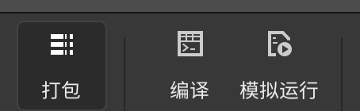

# AWTK-WEB 快速入门 - C 语言 WebSocket 应用程序

> 相对于 XMLHttpRequest/fetch，WebSocket 可以实现双向通信，适合实时通信场景，是 Web 应用程序与服务器通讯的重要方式之一。本文介绍一下如何使用 C 语言开发 AWTK-WEB 应用程序，并用 WebSocket 与服务器通讯。

## 用 AWTK Designer 新建一个应用程序

> 先安装 [AWTK Designer](https://awtk.zlg.cn/web/index.html)

### 2.1. 新建应用程序

> 这里假设应用程序的名称为 AwtkApplicationCWebSocket，后面会用到，如果使用其它名称，后面要做相应修改。


### 2.2. 编写代码

* 用 [VSCode](https://code.visualstudio.com/) 打开目录 AwtkApplicationCWebSocket，并打开文件 src/pages/home_page.c 

> 使用其它文本编辑器或 IDE 也可以，推荐使用 [VSCode](https://code.visualstudio.com/)，并开启 Copilot，将大幅提升开发效率。

* 添加事件处理函数。可以参考下面的代码

```c
typedef struct _home_page_t {
  widget_t* send;
  widget_t* send_text;
  widget_t* recv_text;
  EMSCRIPTEN_WEBSOCKET_T sock;
} home_page_t;

static home_page_t* home_page_create(widget_t* win) {
  home_page_t* home_page = TKMEM_ZALLOC(home_page_t);

  assert(win != NULL);
  assert(home_page != NULL);
  if (home_page != NULL) {
    home_page->send = widget_lookup(win, "send", TRUE);
    assert(home_page->send != NULL);
    home_page->send_text = widget_lookup(win, "send_text", TRUE);
    assert(home_page->send_text != NULL);
    home_page->recv_text = widget_lookup(win, "recv_text", TRUE);
    assert(home_page->recv_text != NULL);
  }

  return home_page;
}

static ret_t home_page_destroy(home_page_t* home_page) {
  if (home_page != NULL) {
    emscripten_websocket_close(home_page->sock, 0, 0);
    TKMEM_FREE(home_page);
  }

  return RET_OK;
}

bool WebSocketOpen(int eventType, const EmscriptenWebSocketOpenEvent* e, void* userData) {
  home_page_t* home_page = (home_page_t*)userData;
  return_value_if_fail(home_page != NULL, FALSE);

  widget_set_text_utf8(home_page->recv_text, "opened");

  /*
  emscripten_websocket_send_utf8_text(e->socket, "hello on the other side");
  char data[] = {0, 1, 2, 3, 4, 5, 6, 7, 8, 9, 10};
  emscripten_websocket_send_binary(e->socket, data, sizeof(data));
  */

  return 0;
}

bool WebSocketClose(int eventType, const EmscriptenWebSocketCloseEvent* e, void* userData) {
  home_page_t* home_page = (home_page_t*)userData;
  return_value_if_fail(home_page != NULL, FALSE);

  emscripten_websocket_delete(e->socket);
  widget_set_text_utf8(home_page->recv_text, "closed");
  home_page->sock = 0;

  return 0;
}

bool WebSocketError(int eventType, const EmscriptenWebSocketErrorEvent* e, void* userData) {
  home_page_t* home_page = (home_page_t*)userData;
  return_value_if_fail(home_page != NULL, FALSE);

  widget_set_text_utf8(home_page->recv_text, "error");

  return 0;
}

bool WebSocketMessage(int eventType, const EmscriptenWebSocketMessageEvent* e, void* userData) {
  home_page_t* home_page = (home_page_t*)userData;
  return_value_if_fail(home_page != NULL, FALSE);

  if (e->isText) {
    widget_set_text_utf8(home_page->recv_text, (const char*)(e->data));
  }

  return 0;
}

static ret_t on_send(void* ctx, event_t* e) {
  home_page_t* home_page = (home_page_t*)ctx;
  return_value_if_fail(home_page != NULL, RET_BAD_PARAMS);

  if (home_page->sock > 0) {
    char text[1024];
    widget_get_text_utf8(home_page->send_text, text, sizeof(text) - 1);
    if (text[0] != '\0') {
      emscripten_websocket_send_utf8_text(home_page->sock, text);
    }
  }

  return RET_OK;
}

EMSCRIPTEN_WEBSOCKET_T create_socket(void* user_data, const char* url) {
  EmscriptenWebSocketCreateAttributes attr;
  emscripten_websocket_init_create_attributes(&attr);

  attr.url = url;
  attr.protocols = "binary,base64";
  EMSCRIPTEN_WEBSOCKET_T socket = emscripten_websocket_new(&attr);

  emscripten_websocket_set_onopen_callback(socket, user_data, WebSocketOpen);
  emscripten_websocket_set_onclose_callback(socket, user_data, WebSocketClose);
  emscripten_websocket_set_onerror_callback(socket, user_data, WebSocketError);
  emscripten_websocket_set_onmessage_callback(socket, user_data, WebSocketMessage);

  return socket;
}

/**
 * 初始化窗口
 */
ret_t home_page_init(widget_t* win, void* ctx) {
  (void)ctx;
  const char* url = "ws://localhost:8090/";
  home_page_t* home_page = home_page_create(win);
  return_value_if_fail(win != NULL && home_page != NULL, RET_BAD_PARAMS);

  assert(emscripten_websocket_is_supported());

  home_page->sock = create_socket(home_page, url);
  widget_on(home_page->send, EVT_CLICK, on_send, home_page);

  return RET_OK;
}
```

> 注意：控件的名称一定要和 home_page.xml 保持一致。

### 2.3. 在 AWTK Designer 中，执行“打包” “编译” “模拟运行”



正常情况下可以看到如下界面：


点击“关闭”按钮，退出应用程序。

## 3. 编写配置文件

* 具体格式请参考 [特殊平台编译配置](https://github.com/zlgopen/awtk/blob/master/docs/build_config.md)

这里给出一个例子，可以在此基础上进行修改（该文件位于 examples/AwtkApplicationCWebSocket/build.json )：

```json
{
  "name": "AwtkApplicationCWebSocket",
  "version": "1.0",
  "assets": "res/assets",
  "vendor": "zlgopen",
  "app_name": "org.zlgopen.AwtkApplicationCWebSocket",
  "author": "xianjimli@hotmail.com",
  "copyright": "Guangzhou ZHIYUAN Electronics Co.,Ltd.",
  "themes":["default"],
  "sources": [
     "src/*.c",
     "src/common/*.c",
     "src/pages/*.c",
     "src/*.h",
     "src/common/*.h",
     "src/pages/*.h"
  ],
  "web": {
    "app_type": "c",
    "assets": "design",
    "config": {
      "fontScale": "0.8",
      "defaultFont": "sans"
    }
  }
```

## 4. 编译 WEB 应用程序

进入 awtk-web 目录，不同平台使用不同的脚本编译：

* Windows 平台

```sh
./build_win32.sh examples/AwtkApplicationCWebSocket/build.json release
```

* Linux 平台

```sh
./build_linux.sh examples/AwtkApplicationCWebSocket/build.json release
```

* MacOS 平台

```sh
./build_mac.sh examples/AwtkApplicationCWebSocket/build.json release
```

> 请根据应用程序所在目录，修改配置文件的路径。

## 5 运行

* 正常启动

```sh
./start_web.sh
```

* 调试启动

```sh
start_web_debug.sh
```

* 启动 websocket 服务器（先安装 nodejs)

> 进入 awtk-web 目录下的 tools/websocket，执行：

```sh
node websocket_echo_server.js 
```

* 用浏览器打开 URL：http://localhost:8080/AwtkApplicationCWebSocket


