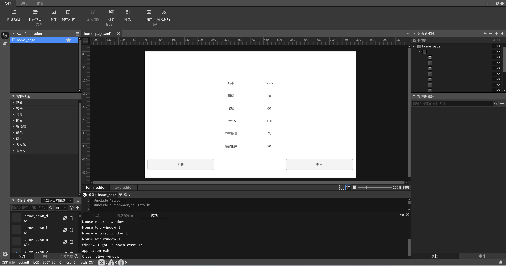
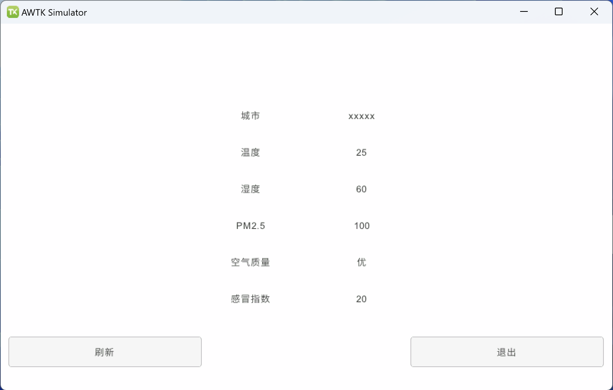
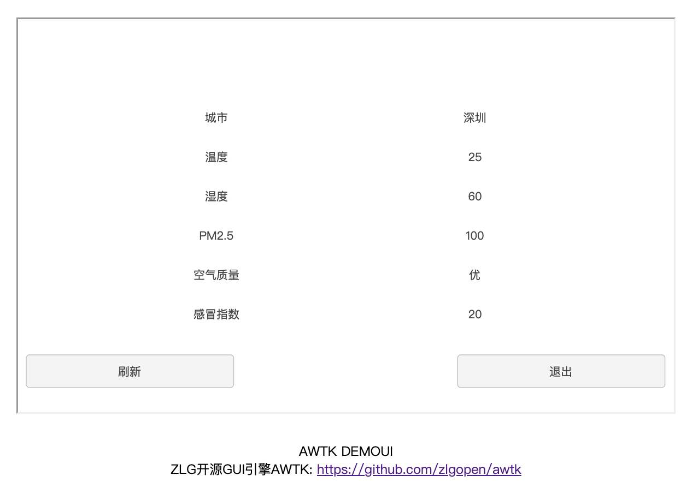
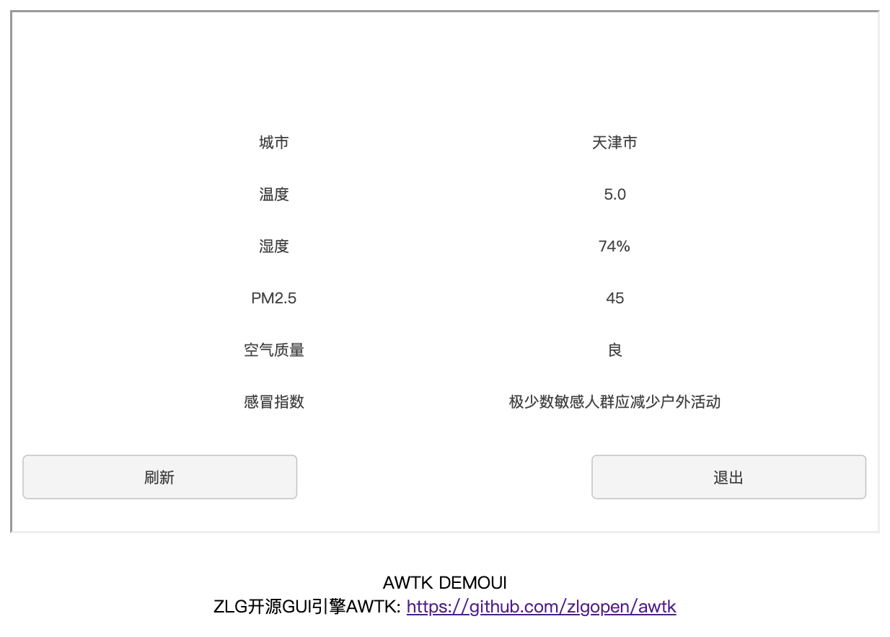

# AWTK-WEB 快速入门 - JS Http 应用程序

> 先安装 [AWTK Designer](https://awtk.zlg.cn/web/index.html)

## 用 AWTK Designer 新建一个应用程序

### 2.1. 新建应用程序

> 这里假设应用程序的名称为 AwtkApplicationJSHttp，后面会用到，如果使用其它名称，后面要做相应修改。



### 2.2. 为按钮编写代码

* 删除 src 目录下全部文件（留着也可以，只是看起来比较乱），在 src 目录创建 js 目录。

* 在 src/js 下创建 application.js ，内容如下

```js
function applicationInit() {
  home_page_open();
}

applicationInit()
```

* 在 src/js 下创建  home_page.js，内容如下

```js
async function on_update_clicked(evt) {
  var e = TPointerEvent.cast(evt);
  var widget = TButton.cast(e.target); 

  const win = widget.getWindow();
  const url = "http://localhost:8080/AwtkApplicationJSHttp/res/assets/default/raw/data/weather.json";

  try {
    const response = await fetch(url);
    if (!response.ok) {
      throw new Error("Network response was not ok " + response.statusText);
    }
    const json = await response.json();
    win.setChildText("city", json.cityInfo.city);
    win.setChildText("wendu", json.data.wendu);
    win.setChildText("ganmao", json.data.ganmao);
    win.setChildText("quality", json.data.quality);
    win.setChildText("shidu", json.data.shidu);
    win.setChildTextWithDouble("pm25", "%.0f", json.data.pm25);
  } catch (error) {
    console.error("There was a problem with the fetch operation:", error);
  }
}

function home_page_open() {
  var win = TWindow.open("home_page");
  var update = win.lookup("update", true);

  update.on(TEventType.CLICK, on_update_clicked);

  win.layout();
}
```

> 注意：控件的名称一定要和 home_page.xml 保持一致。

### 2.3. 在 AWTK Designer 中，执行“打包” “编译” “模拟运行”


正常情况下可以看到如下界面：



点击“关闭”按钮，退出应用程序。

## 3. 编写配置文件

* 具体格式请参考 [特殊平台编译配置](https://github.com/zlgopen/awtk/blob/master/docs/build_config.md)

这里给出一个例子，可以在此基础上进行修改（该文件位于 examples/AwtkApplicationJSHttp/build.json )：

```json
{
  "name": "AwtkApplicationJSHttp",
  "version": "1.0",
  "app_type":"js",
  "author": "xianjimli@hotmail.com",
  "copyright": "Guangzhou ZHIYUAN Electronics Co.,Ltd.",
  "themes":["default"],
  "sources": [
     "src/js/*.js"
  ]
}
```

## 4. 编译 WEB 应用程序

进入 awtk-web 目录，不同平台使用不同的脚本编译：

* Windows 平台

```sh
./build_win32.sh examples/AwtkApplicationJSHttp/build.json release
```

* Linux 平台

```sh
./build_linux.sh examples/AwtkApplicationJSHttp/build.json release
```

* MacOS 平台

```sh
./build_mac.sh examples/AwtkApplicationJSHttp/build.json release
```

> 请根据应用程序所在目录，修改配置文件的路径。

## 5 运行

* 正常启动

```sh
./start_web.sh
```

* 调试启动

```sh
start_web_debug.sh
```

* 用浏览器打开 URL：http://localhost:8080/AwtkApplicationJSHttp



> 点击 “更新” 按钮，可以看到数据更新。



