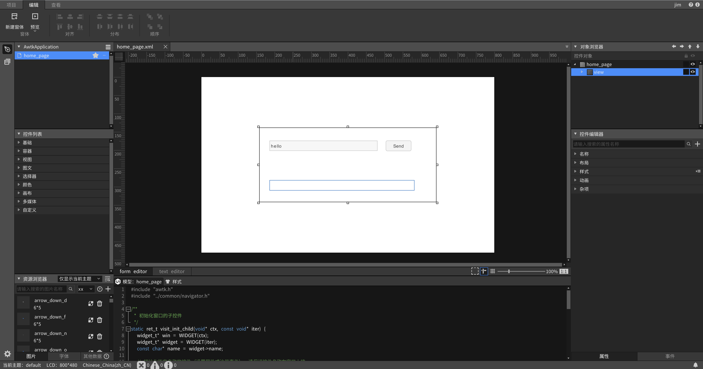
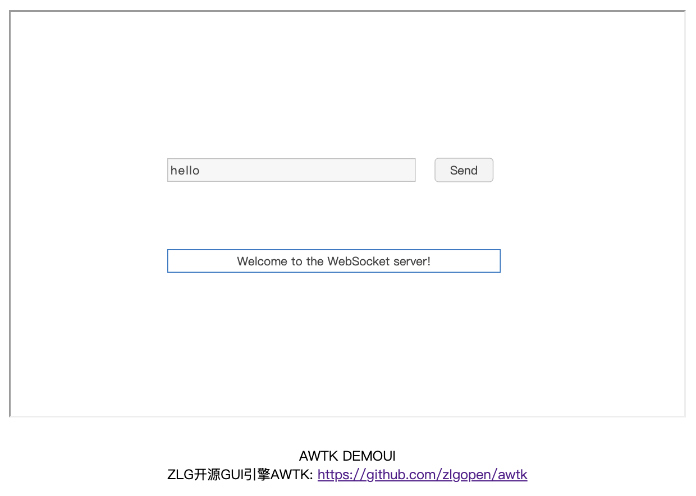

# AWTK-WEB 快速入门 - JS WebSocket 应用程序

> 先安装 [AWTK Designer](https://awtk.zlg.cn/web/index.html)

## 用 AWTK Designer 新建一个应用程序

### 2.1. 新建应用程序

> 这里假设应用程序的名称为 AwtkApplicationJSWebSocket，后面会用到，如果使用其它名称，后面要做相应修改。



### 2.2. 为按钮编写代码

* 删除 src 目录下全部文件（留着也可以，只是看起来比较乱），在 src 目录创建 js 目录。

* 在 src/js 下创建 application.js ，内容如下

```js
function applicationInit() {
  home_page_open();
}

applicationInit()
```

* 在 src/js 下创建  home_page.js，内容如下

```js
function home_page_open() {
  var win = TWindow.open("home_page");
  var send = win.lookup("send", true);
  var send_text = win.lookup("send_text", true);
  var recv_text = win.lookup("recv_text", true);
  const ws = new WebSocket("ws://localhost:8090");

  send.on(TEventType.CLICK, function (evt) {
    const message = send_text.getText();
    const str = wstrToString(message);

    ws.send(str);
    return TRet.OK;
  });

  ws.onopen = () => {
    recv_text.setText("Connected to the server");
  };

  ws.onmessage = (event) => {
    recv_text.setText(event.data);
  };

  ws.onclose = () => {
    recv_text.setText("close");
  };

  win.layout();
}
```

### 2.3. 在 AWTK Designer 中，执行“打包” “编译” “模拟运行”


正常情况下可以看到如下界面：


点击“关闭”按钮，退出应用程序。

## 3. 编写配置文件

* 具体格式请参考 [特殊平台编译配置](https://github.com/zlgopen/awtk/blob/master/docs/build_config.md)

这里给出一个例子，可以在此基础上进行修改（该文件位于 examples/AwtkApplicationJSWebSocket/build.json )：

```json
{
  "name": "AwtkApplicationJSWebSocketWebSocket",
  "version": "1.0",
  "app_type":"js",
  "author": "xianjimli@hotmail.com",
  "copyright": "Guangzhou ZHIYUAN Electronics Co.,Ltd.",
  "themes":["default"],
  "sources": [
     "src/js/*.js"
  ]
}
```

## 4. 编译 WEB 应用程序

进入 awtk-web 目录，不同平台使用不同的脚本编译：

* Windows 平台

```sh
./build_win32.sh examples/AwtkApplicationJSWebSocket/build.json release
```

* Linux 平台

```sh
./build_linux.sh examples/AwtkApplicationJSWebSocket/build.json release
```

* MacOS 平台

```sh
./build_mac.sh examples/AwtkApplicationJSWebSocket/build.json release
```

> 请根据应用程序所在目录，修改配置文件的路径。

## 5 运行

* 正常启动

```sh
./start_web.sh
```

* 调试启动

```sh
start_web_debug.sh
```

* 启动 websocket 服务器（先安装 nodejs)

> 进入 awtk-web 目录下的 tools/websocket，执行：

```sh
node websocket_echo_server.js 
```

* 用浏览器打开 URL：http://localhost:8080/AwtkApplicationJSWebSocket



## 6、AWTK-WEB-JS 和 AWTK-JS 不同

两者在 API 上基本上是一样的，但是由于浏览器和 Jerryscript 的差异，导致少量功能无法做到完全一致，需要应用程序自行规避。

* 1.AWTK-WEB-JS 不支持模态对话框。
* 2.AWTK-WEB-JS 中的 print 函数是打印。请使用 console.log 输出调试信息。
* 3.AWTK-WEB-JS 不支持自动回收在 wasm 中分配的对象（如：color/rect/value 等）。如果希望两者通用，请避免使用这类函数。
* 4.tk_quit 函数并不能退出应用程序。
